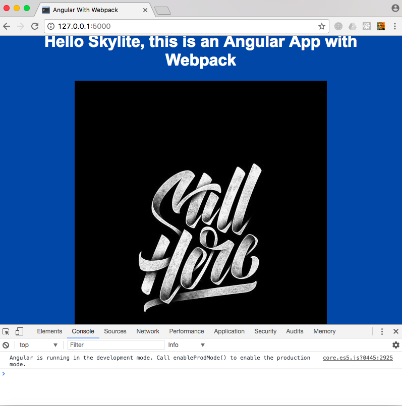

# flask_angular
Starter kit for webapp. Backend: flask, frontend: angular4 with ts and webpack
Mostly based on https://angular.io/guide/webpack#webpack-an-introduction




# Install
get python3, node, and npm, webpack

# Setup
get a virtualenv and do 
```
pip install -r requirements.txt
```
install js dependencies:
```
npm install
```
# To Run
do 
```
webpack --watch
```
and 
```
python app.py
```

